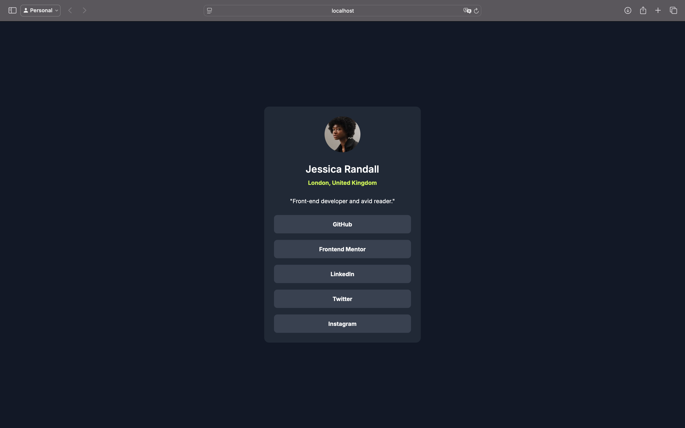

# Frontend Mentor - Social links profile solution

This is a solution to the [Social links profile challenge on Frontend Mentor](https://www.frontendmentor.io/challenges/social-links-profile-UG32l9m6dQ). Frontend Mentor challenges help you improve your coding skills by building realistic projects.

## Table of contents

- [Overview](#overview)
  - [The challenge](#the-challenge)
  - [Screenshot](#screenshot)
  - [Links](#links)
- [My process](#my-process)
  - [Built with](#built-with)
  - [What I learned](#what-i-learned)
  - [Continued development](#continued-development)
  - [Useful resources](#useful-resources)
- [Author](#author)
- [Acknowledgments](#acknowledgments)

## Overview

### The challenge

Users should be able to:

- See hover and focus states for all interactive elements on the page.

### Screenshot



### Links

- Solution URL: [Solution](https://github.com/aeosmanoglu/social-links-profile)
- Live Site URL: [Live Site](https://aeosmanoglu.github.io/social-links-profile/)

## My process

### Built with

- Semantic HTML5 markup
- Tailwind CSS
- Flexbox
- Mobile-first workflow
- [Inter](https://fonts.google.com/specimen/Inter) - Font family

### What I learned

In this project, I improved my skills using Tailwind CSS for responsive design and flexbox layout. I also focused on implementing hover and focus states efficiently with Tailwind's utility classes.

Here is an example of the button hover effect I implemented:

```css
@import url('https://fonts.googleapis.com/css2?family=Inter:wght@400;600;700&display=swap');

@tailwind base;
@tailwind components;
@tailwind utilities;


@layer components {
    button {
        @apply flex flex-row justify-center p-3 font-bold leading-[150%] rounded-lg text-white bg-gray-700 w-full;
    }

    button:hover {
        @apply text-gray-700 bg-primary;
    }
}
```

### Continued development

In future projects, I plan to dive deeper into advanced Tailwind CSS utilities and improve my proficiency with custom configurations. I also want to explore more accessibility features for better user experiences.

### Useful resources

- [Tailwind CSS Documentation](https://tailwindcss.com/docs) - The official documentation helped me understand how to effectively use the utility-first approach.
- [Frontend Mentor](https://www.frontendmentor.io) - This platform provides great challenges to practice real-world scenarios in front-end development.

## Author

- Website - [Abuzer Emre Osmanoğlu](https://abuzeremre.com)
- Frontend Mentor - [@aeosmanoglu](https://www.frontendmentor.io/profile/aeosmanoglu)
- Twitter - [@abuzeremreo](https://twitter.com/abuzeremreo)

## Acknowledgments

Thanks to [Frontend Mentor](https://www.frontendmentor.io) for providing an engaging and realistic challenge that helped me hone my skills. Also, a shout-out to the Tailwind CSS community for their awesome documentation and support.
